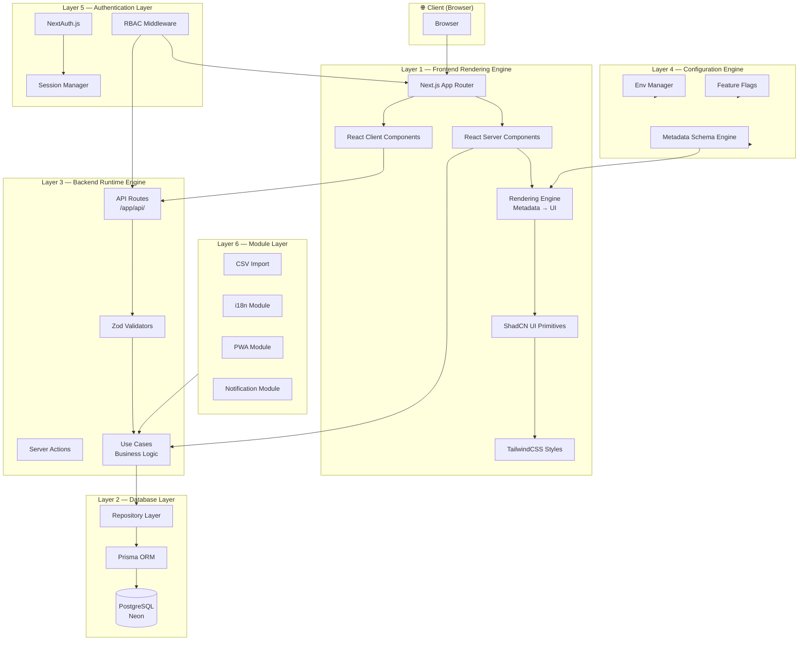
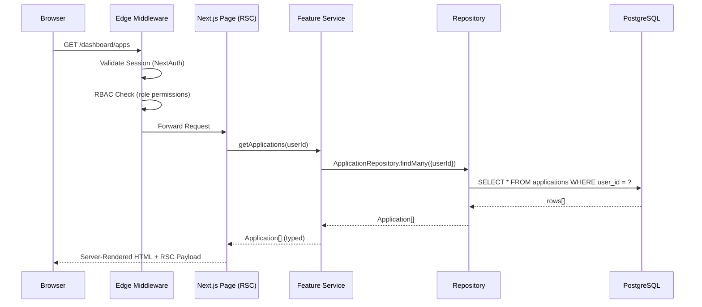
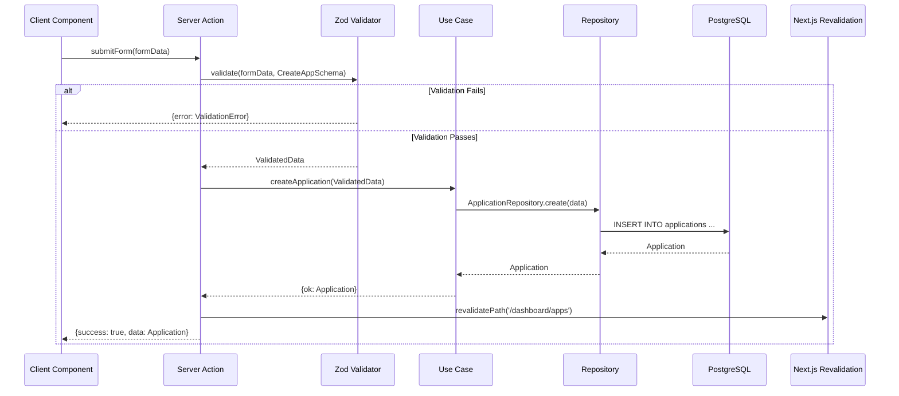
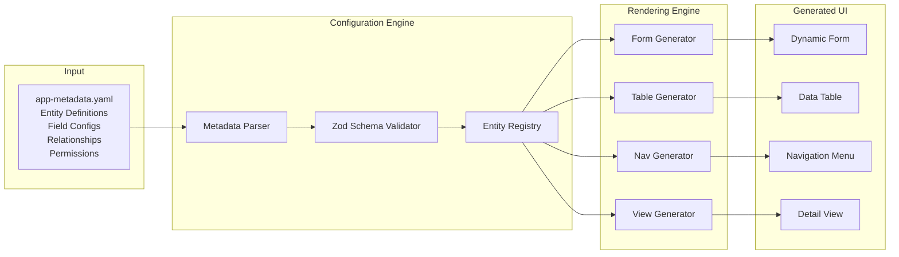
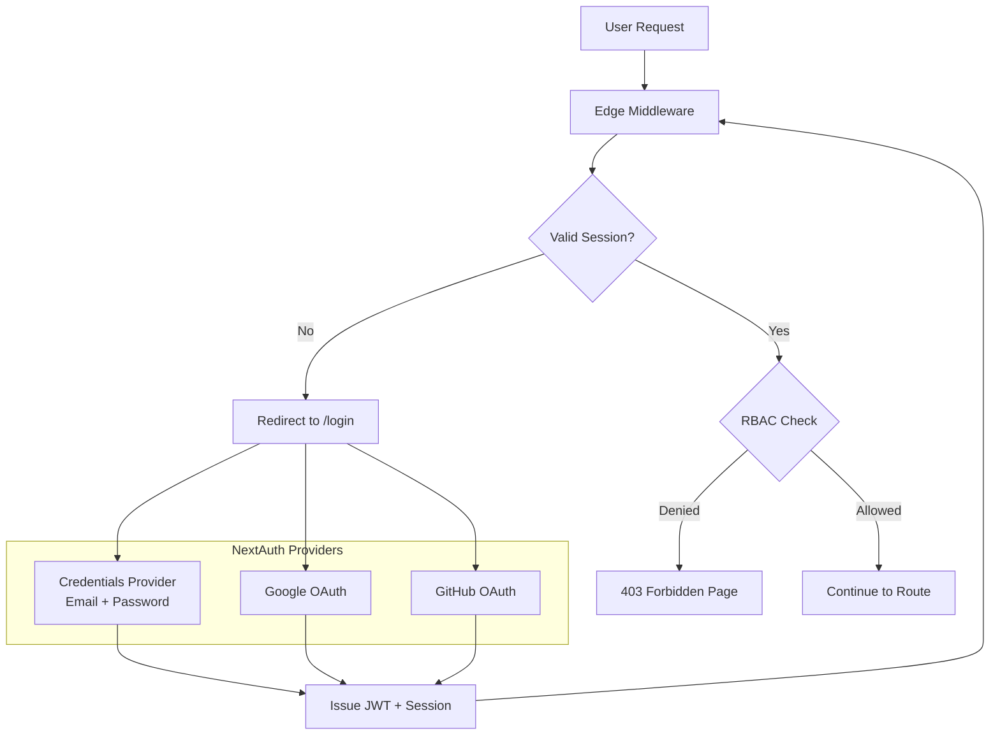
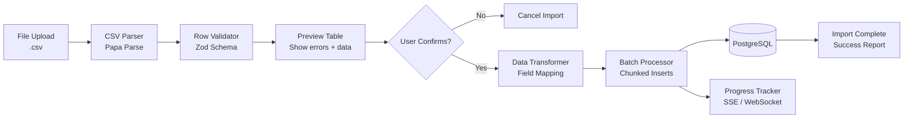
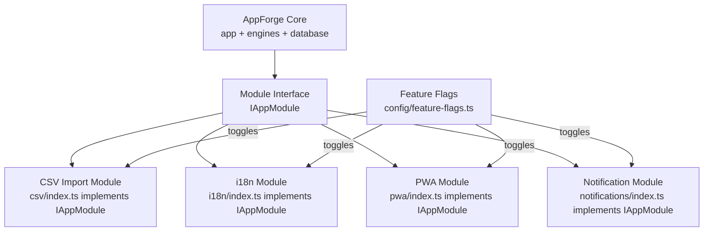
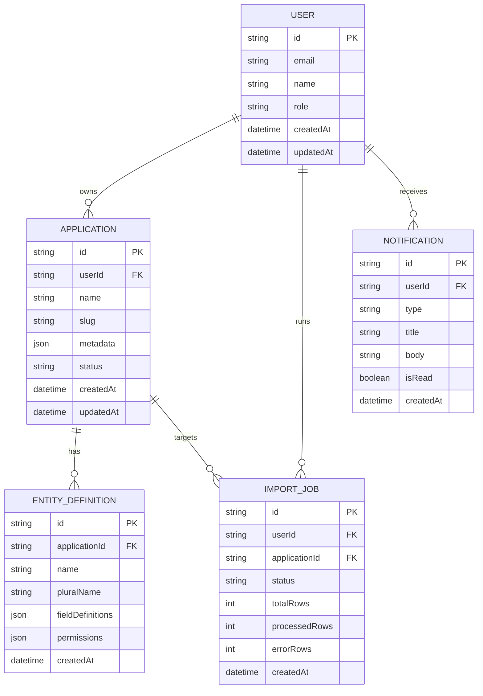
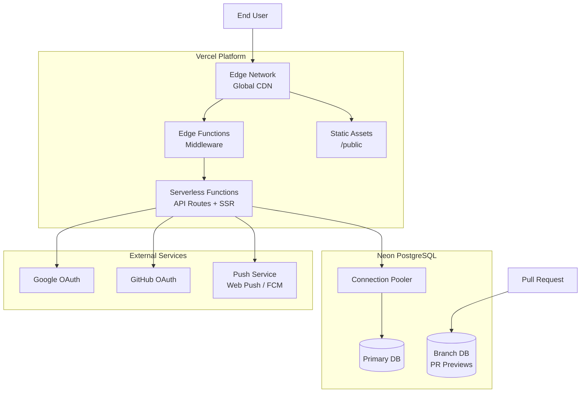
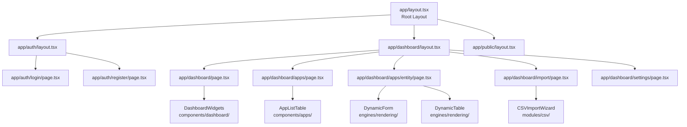

# AppForge AI — Architecture Diagrams

---

## Diagram 1: System Layer Architecture

---

## Diagram 2: Request Lifecycle (Read Flow)

---

## Diagram 3: Request Lifecycle (Write Flow via Server Action)

---

## Diagram 4: Metadata-Driven UI Generation Flow

---

## Diagram 5: Authentication & RBAC Flow

---

## Diagram 6: CSV Import Module Pipeline

---

## Diagram 7: Module Plug-and-Play Architecture

---

## Diagram 8: Database Entity Relationship (Core Entities)

---

## Diagram 9: Deployment Architecture (Vercel + Neon)

---

## Diagram 10: Component Hierarchy

